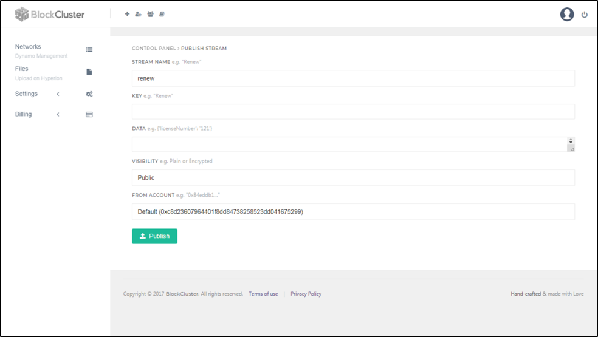

> # ==**Getting Started with BlockCluster**==

This guide will give you a jumpstart for using BlockCluster platform to develop Private Blockchain applications for your business.

This article is for developers who want to build enterprise dapps using BlockCluster. Even if you are not a developer you can still follow this article and get an idea about how BlockCluster makes it super simple to build dapps. 

> ## **Table of Contents**

### [About BlockCluster]()

### [Use BlockCluster in 5 Easy Steps]()

1. ##### [Create Your Blockchain Network]()

2. ##### [Invite Other Parties to Join Your Network]()

   - [Manually Join the Network]()
   - [Invite User to Network]()

3. ##### [Create Assets]()

   - [Create Assets representing tangible/physical assets like 'Land']()
   - [Create Assets representing monetary assets like 'Currency']()
   - [Create Blockchain Accounts]()

4. ##### [Issue Assets]()

5. ##### [Exchange Assets]()

### [Other Features]()

1. [Streams - Message queue]()

2. [Notification - WEBBOOKS]()

3. [See Details of the Transactions]()

4. [Search for a Particular Solo Asset or Stream Information]()

5. [Know About History of an Asset]()

6. [Add Your Own Smart Contracts]()

## **About BlockCluster**

BlockCluster is a platform to create any kind of asset-based Blockchain use-case in which you can control privacy, permission over the assets, and issue assets to other users on the network. It is available in two version: Public Cloud and Enterprise Installation. The public cloud version can be accessed via app.blockcluster.io, while Enterprise version can be installed on the premises or your own AWS/Azure/GCP account.

The beauty of BlockCluster is that regardless of where the blockchain nodes are deployed they can communicate with each other. For example: if the first node is deployed on app.blockcluster.io then an organization who is using the on-prem installation of BlockCluster can connect to it i.e., join the network.

 

*BlockCluster has 3 major components:*

1. BlockCluster PaaS
2. Dynamo Protocol
3. Impulse Privacy Layer

**BlockCluster PaaS:** It is a platform to deploy dynamo nodes. However, all the functions that are available via UI can also be done programmatically. For example: 'Join/Create Blockchain Network' can be done using platform APIs and all the other functions available in the 'Control Panel' can be performed using dynamo APIs. 

**Dynamo**: A protocol to develop Blockchain network that offers features such as creating and issuing assets, streams, atomic swaps, search, etc. 

**Impulse**: Dynamo Protocol uses Impulse proxy re-encryption distributed server for privacy. Even the impulse server itself can't see everything, only the parties having access to the information can see the information.

**Why Dynamo Protocol?**

Dynamo Protocol lets you develop private permissioned Blockchain. Dynamo has been build on top of the Ethereum protocol. Assets, Streams and Atomic Swap features of Dynamo are actually auto-deployed smart contracts on the networks. You can also write your own smart contracts if you wish not to use any auto-deployed contracts.

It uses **IBFT consensus protocol** which is configured to have 3 seconds block time and no forks. 75% of the authorities have to agree for a block to be added to the blockchain.

*<u>Here are the various features of Dynamo:</u>*

- *Assets:* It lets you define assets, issue assets and transfer ownership of these assets to other users on the Blockchain while creating an auditable trail history.
- *Streams:* Streams can be compared with a message queue. You can create multiple streams, each holding any number of messages in key-value format. Most common use of streams is to allow organizations in the network to send messages to each other.
- *Atomic Swaps:* Let's two users/enterprises swap assets without a third party. User A can sell X to B and B can sell Y to A without an escrow account. So, it guarantees both transactions to happen or neither will happen.
- *Advanced Query - Search:* It lets you search for any assets or streams stored across the blockchain network by typing in simple NoSQL queries.
- *Proxy Contracts: Proxy contracts are those smart contracts which interact with Assets and Streams smart contracts. If you want to implement custom logic, advanced permissions, sanitization/validation over data etc. on Assets and Streams, then you can write proxy contracts. Proxy contracts read and write to Assets and Streams contracts instead of you directly interacting with those contracts. As the data is stored in Assets and Streams contracts, therefore, proxy contracts are upgradable.*
- *Voting-based Consensus Mechanism:* A new 'Authority' node can join the network only if it gets 75% upvote from the current 'Authority' nodes present in the network.
- *Auto Generate APIs:* Dynamo provides REST APIs for all its features such as Assets, Streams, Atomic Swaps, Search and so on. If you are writing your own smart contracts, then Dynamo generates APIs for those contracts too. 

## **Use BlockCluster in 5 Easy Steps**

After successfully registering yourself on BlockCluster, you can start building your Private Permissioned Blockchain solution by following these 5 easy to follow steps:

1. **Create Your Blockchain Network:** In this step, you would be creating a single node network by selecting a few options.

2. **Invite Other Parties to Join Your Network:** The next step is to invite other parties to join your Blockchain network with whom you wish to do transactions.

3. **Create Assets:** In this step, you would define the ‘asset type.’ You would also make different Blockchain accounts to transfer assets to them, and control what attributes of the assets would be visible to other parties.

4. **Issue Assets:** You can issue already defined asset types to other Blockchain accounts. 

5. **Exchange Assets:** Use 'atomic swap' to exchange assets based on an offline agreement without a third party. 

These steps are explained in detail below. For the ease of understanding, we have referred the use-case of 'Land Registry' - Issuance of Land Records on Blockchain in various parts of this tutorial.

 

#### **1. Create Your Blockchain Network**

Create a BlockCluster account by visiting app.blockcluster.io. After successfully logging in to your BlockCluster account for the first time, the first screen you will see is 'Create Your Blockchain Network.' 

On this screen, you will be creating a single node network by following these steps:

1. Enter the desired Blockchain network name in the 'Network Name' box. For example, Land_Records

2. Other values would be pre-selected. However, you can select 'Node Type.' There are two types of nodes available in the BlockCluster i.e. 'Light Node' and 'Power Node' that offer different no. of CPUs, RAM, and Disk Space. 

3. If you have a promotional voucher code, enter it in the voucher code box and click 'Redeem.' Otherwise, click 'Create.'

4. The node will be created, and you will be redirected to the 'control panel' of the Blockchain node.

> **Note**: It will take 40 - 50 seconds for the node to initialize. You can check the status of the node by clicking the option 'Node Info and Setting' in the 'Settings' section (bottommost). *The first enterprise who creates the network hosts the impulse server.*
>
> In the illustrated example, the Blockchain Network would be created by the *Government*, which would be issuing land assets in the later part of the document.
>

#### **2. Invite Other Parties to Join Your Network**

Once your network is up and running, you need to invite other parties with whom you want to do transactions, i.e. issue/exchange assets.

In the 'Join network' screen, you would see 2 options:

##### **a. Manually Join the Network**

Use this option if you are connecting to a node that’s outside of the cloud that you are on. Based on the kind of user you are, you need to fill out details and click 'Join.'

 

##### **b. Invite User to Network**

This option can be used to invite someone to join your blockchain network who already has an account on the same cloud that you are on. You just need to enter their email id, select node type (Authority or Peer) and click 'Invite.' The other party would receive an invitation request which they can view in 'manage invitation' screen. They need to click 'accept' to join your Blockchain network. Additionally, they would also receive email on their registered email id.

 

In the illustrated example, the other party who will be invited to join the network would be *Central Bank*, which would be issuing monetary assets (currency) in the later part of the document.

> **Note:** When a node joins the network as an 'Authority,' it must get **75% upvote** from the 'Authority' nodes already present in the network. 

 

#### **3. Create Assets** 

Once you and your party/parties are on your Blockchain network, you both need to define assets and issue them. In the illustrated example, the Government would define and issue land assets, while the Central Bank would define and issue monetary assets (currency). 

##### **a. Create Assets representing tangible/physical assets like 'Land'**

1. Click on 'Create Asset Type' from 'Control Panel.'

 

 

2. Enter 'Asset Name.' For Government, it can be 'Land_Records'. 

 

3. Select 'Asset Type' as 'Solo.' The assets like land records, licenses, registration certificates, patient records, etc. are examples of solo asset type.

4. Issuing Address will be pre-selected since BlockCluster has only one issuing address on Dynamo Blockchain as of now.

5. Click 'Create.'

> **Note**: You can check the new asset created in the 'STATS' option. As of now, the number of units (issued) in this screen would be '0.' 

 

##### **b. Create Assets representing monetary assets like 'Currency'**

1. Click on 'Create Asset Type' from 'Control Panel.'

2. Enter 'Asset Name.' For Central Bank, it will be currency, like 'US Dollar.'

3. Select 'Asset Type' as 'Bulk.' The assets like fiat currency, cryptocurrency, ICO Tokens are examples of bulk asset type.

 

 

4. After selecting 'Asset Type' as 'Bulk' you would need to enter a few more details as follows:

- *Re-Issuable* - Here you need to define whether your asset would be re-issuable or not. In the illustrated example, US Dollars is re-issuable. Hence, we need to select 'Yes' from the options.
- *Decimals* - The US Dollars or any other fiat currency have up to 2 decimals. However, there are more number of decimals in cryptocurrencies, for example, Ethereum has up to 18 decimals. 

5. Issuing Address will be pre-selected.
6. Click 'Create.'

 

##### **c. Create Blockchain Accounts**

To create a Blockchain account

1. Click on 'ACCOUNTS' in the development tool section. You will be redirected to 'ACCOUNTS MANAGEMENT' screen.

 

2. Enter the desired name and password for the new account.

3. Click 'Create.'

 

#### **4. Issue Assets**

To issue assets:

1. Click on the 'Manage Assets' from the 'Assets' section.

 

2. You will land on 'Manage Assets' screen which offers the following options:

- *ISSUE ASSETS:* Here you can issue bulk and solo assets. Select the transferor account in the 'TO ACCOUNT' box and copy address of the 'transferee account' in the 'FROM ACCOUNT' box. And Click 'Issue Asset.  

> For bulk assets, you will need to mention 'no. of units.' For example - 50000 (USD).
>
> For solo assets, you will need to mention a unique 'IDENTIFIER.' For example - Land registry number.

- *TRANSFER ASSETS:* This is for transferring the ownership of already issued assets from one account to 	another by entering the same details as mentioned in the above point. Note that only the owner of the asset can transfer it.

- *GET ASSET INFO:* 

  For bulk assets - You can get the bulk asset balance (number of the bulk asset issued) by selecting 'ASSET NAME' and 'ACCOUNT.' And then click 'Get Balance.' In the illustrated example, you can check the amount of USD issued i.e. 50,000.

  For solo assets - You can get info about a solo asset by selecting 'ASSET NAME' and entering the unique 'IDENTIFIER.' And then click 'Get Info.' In the illustrated example, you can get details of a particular land record by entering its specific land registry number. 

  > **Note:** In the asset info window, the solo assets which are transferable would have the status as 'open.'

- ADD/UPDATE SOLO ASSET INFO:

  This option allows you to add/update asset info. Only the issuer of the asset can add/update asset metadata. You need to first select 'ASSET NAME' and owner in 'FROM ACCOUNT.' Then you need to enter a unique 'IDENTIFIER', for example, land registry number. Enter the field name in the 'KEY' box and its amount/quantity/number/name in the 'VALUE' box. For example, for a land record, 'owner_age' can be entered in the 'KEY' box and the value, let's say '25' can be added in the 'Value.'

In the last box by the name 'VISIBILITY', you can control the privacy of the information you are going to add. If you select 'Private' the information will be viewed only by the dynamo node which issued the asset. In case you select 'Public,' the information would be visible to all the nodes.

> *Impulse central server does this proxy re-encryption and enable asset-based permissions.*

- *CLOSE SOLO ASSET:* This option allows you to set the status of a solo asset as 'Closed.' No action can be performed on the solo asset with 'Closed' status.

- *PRIVACY:* This option allows you to give permission to a particular dynamo node to access the private information of an asset. For this, the grantor would need grantee's node’s 'Public Key', which can be found in the 'IMPULSE' option under the section 'Miscellaneous.' In the illustrated example, if the Government wants to allow Central Bank to see the private metadata of an asset, then it would have to give access to Central Bank.

  

 

> **Note:** Only Enterprises (in the illustrated example - Government & Central Bank) can issue assets to each other. If they want to issue assets to other Blockchain users, then there are two options based on use-case:
>
> 1. If they want Blockchain user (in the illustrated example - they can be property owners) to control ownership of the assets i.e., the user will hold the private key to transfer the asset, then the account needs to be generated outside of BlockCluster and transactions will be signed using the private key offline. For example, the Government would issue paper based private key to the property owners. The accounts of the property owners would be outside BlockCluster and at the time of transferring the ownership to some other user, the transactions need to be signed using the private key. 
>
> 2. If they want to control their user's assets, then they need to issue all assets to a single account owned by them. For example, Government would issue all the assets to another Blockchain account own by it.

*STATS:* In this option (also available under 'Asset' section), you can see stats of all the asset type, number of units issued and accounts that owns them. 

#### **5. Exchange Assets**

You can exchange assets inside BlockCluster using 'EXCHANGE' options under 'Advanced Features' section. It will allow you to do the atomic swaps between assets. The interesting part of the exchange feature is that it allows you to atomically exchange assets between two different networks. For example, the owner of a land record (seller) want to swap it with another account (buyer) owning bulk asset 'dollars' based on an offline mutual agreement. 

 

The seller of the asset can do so by using the 'PLACE ORDER' option and entering the details such as: 

1. ASSET TYPE, for example, for selling account it can be a solo asset - land record and for buying, it can be a bulk asset - Dollars.
2. Select 'ASSET NAME' accordingly.
3. In case of a solo asset, enter a unique 'IDENTIFIER' (example - land registry number). In the case of a bulk asset, enter 'UNITS' (example - 15000 dollars).
4. Select the 'TIME PERIOD' for which both assets would remain locked in. For this time period, no action can be performed on the assets, for example, they can't be transferred. This is to avoid double spending.
5. Select the 'SELLER' account and enter the 'BUYER' account address.
6. Click 'Place Order'

Now, to complete the transactions, the buyer needs to go to the 'Fulfill Order' section. He needs to enter the 'ORDER ID,' select 'Network' and 'Account' from which it is swapping the asset and then click 'Submit.' 

You can see the status of all the orders in the 'ORDER BOOK' and 'CANCEL ORDER' after the lock-in period.

 

## **3. Other Features**

#### **Streams**

Streams can be used for nodes to send messages to each other on the blockchain. For example - Government can create a notification to renew land record agreement after 10 years.

1. Create a stream by clicking on 'Create Stream' in the ‘Streams’ section of the control panel. Type stream name in the 'STREAM NAME' box and select the account from which you want to create the messages in the "ISSUING ADDRESS" box and click 'Create.'

2.  Publish messages to the stream by clicking on the 'PUBLISH STREAM' option. You would need to enter 'KEY' (for example, land_record) and 'DATA' (for example, land registry number). This would tell the receiver what the message is about. You can hide value in the 'DATA' field from being 'publicly' visible by selecting 'VISIBILITY' as Private. In this case, you would need to enter the 'Private Key' of the receiver node, and only this node would be able to see the information. You cannot grant/revoke access to the data once the event is published.

> In the illustrated example, if the Government doesn't want the land registry number to be publicly visible, then it can choose to show it only to the receiver account. 
>
> Choose the publishing account in the 'FROM ACCOUNT' and click 'Publish.'
>
> **Note:** You can add multiple private keys if you want the event 'DATA' to be viewed by multiple accounts. Once the permission is granted to a particular number of nodes, it can't be changed/modified later. So, you won't be able to grant permission to more nodes or revoke permission.

3. If you want other accounts to be able to publish messages from your stream, then you can add publishers (add account addresses of the publishers) by clicking on the 'ACCESS CONTROL' option available under the 'Streams' section.

 

#### **Notifications**

Click on the 'INTEGRATE WEBBOOKS' option available under 'Miscellaneous' section. Paste WEBBOOK URL here to get notifications of all the events on the URL.

 

#### **See Detail of the Transactions** 

Click on the 'AUDIT' option available under 'Miscellaneous' section. It will take you the Blockchain explorer screen where you can see the decoded details of all the transaction by entering their hash string in the search box.

 

#### **Search for a Particular Solo Asset or Stream Information**

BlockCluster supports making No-SQL style queries with the option 'SEARCH' available under 'Advanced Features' section. You can search for any solo asset or messages of streams with particular information. For example, land record with a particular age or name, by typing simple database queries.

 

#### **Know About History of an Asset**

Click on 'ASSET HISTORY' option available under the 'Advanced Features' section. Select 'ASSET NAME' and enter the unique 'IDENTIFIER.' Click 'Download Report.' You will receive a pdf containing all the information.

 

#### **Add Your Own Smart Contracts**

Click on the 'ADD SMART CONTRACTS' option available in the 'Development Tools.' Enter 'NAME', 'BYTE CODE' and 'ABI.' Click 'Add' when you are done. Now REST APIs for these contracts will be automatically generated and also when transactions related to these contracts are audited in the explorer, the transaction input and logs are automatically decoded, therefore giving you a better way to audit transactions. The most common use of this feature is to add proxy contracts.

 