# Getting Started with Privatehive

In this tutorial we will learn how to create a Hyperledger Fabric networks and deploy networks using Privatehive, BlockCluster's Hyperledger Fabric-as-a-Service. 

> One of the most important feature of our Hyperledger Fabric-as-a-Service, which makes it different than other solutions is that different installations of BlockCluster i.e., blockcluster cloud, private cloud and on prem installations can connect with each other and form a network therefore achieving true *decentralisation*.

In this tutorial we will create a network consisting of 3 peer organisations and 1 orderer organisation. Then we will deploy the [marbles02_private](<https://github.com/hyperledger/fabric-samples/tree/master/chaincode/marbles02_private>) chaincode and invoke/query using REST APIs.

## Creating Peer and Orderer Organisations

Let's create 3 peer organisations. We will name the organisations as Org1, Org2 and Org3. To create peer organisations click on "Privatehive" on navbar and "Create" tab.

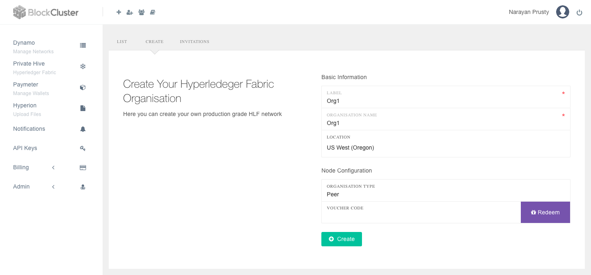

> Here "Label" is just an identifier for your organisation in Blockcluster dashboard. Whereas "Organisation Name" is the name of the organisation in the network. In real-world scenerio "Organisation Name" will be same for all peer organisations of all use-cases. Whereas Label can be used for identifying to which use-case the peer organisation belongs to.

After you create 3 peer organisations, you organisations list will look similar to this:

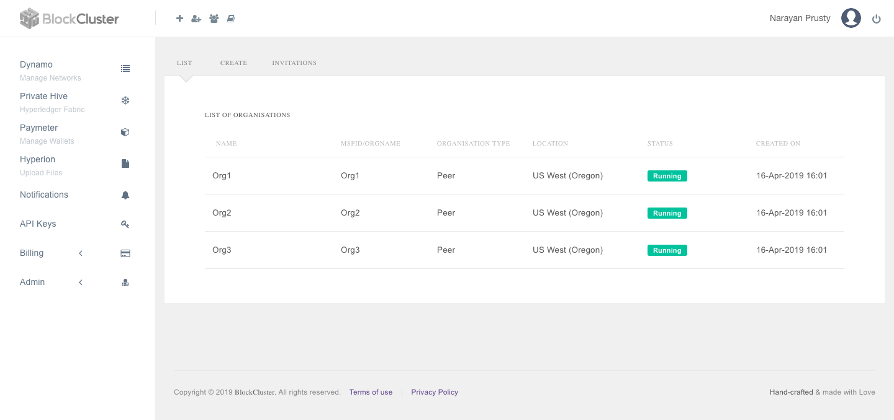

Now let's create the orderer organisation. For this click on "Create" and select "Orderer" instead of "Peer". For you you can keep the orderer type as "Solo" as it's just a demo. In production, you will need to select "Kafka". 

While creating orderer organisation, it will ask to select a peer organisation who can create channels in the orderer. The selected peer can only create channels in that orderer no other peer organisation has permission. Also make sure the status of the peer is "Running".

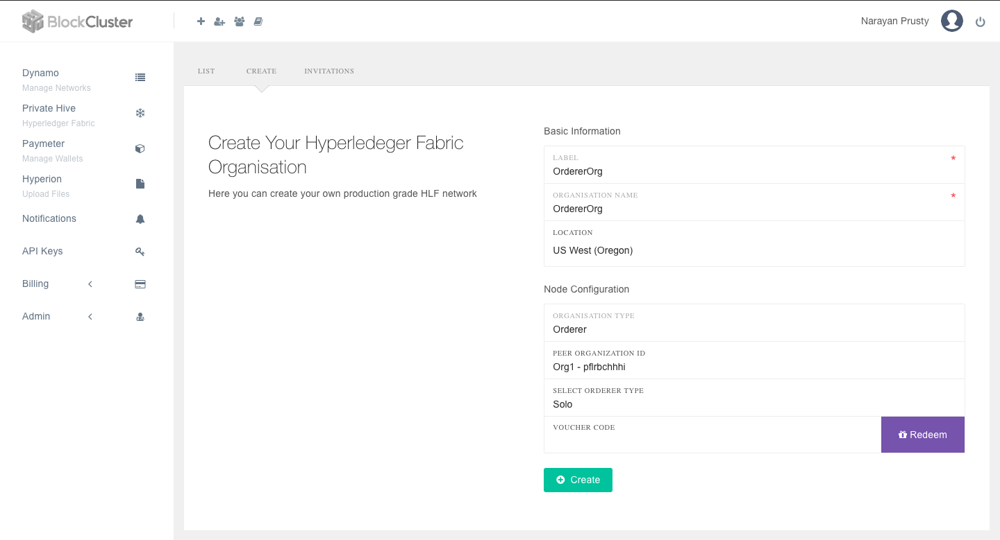

Here we selected Org1 as the peer organisation who can create channels in this orderer.

## Creating and Inviting to Channels

Now let's create a channel name "testchannel" and add all the three peer organisation into it. For this, click on the "Org1" peer organisation in list and you will see control panel for the peer

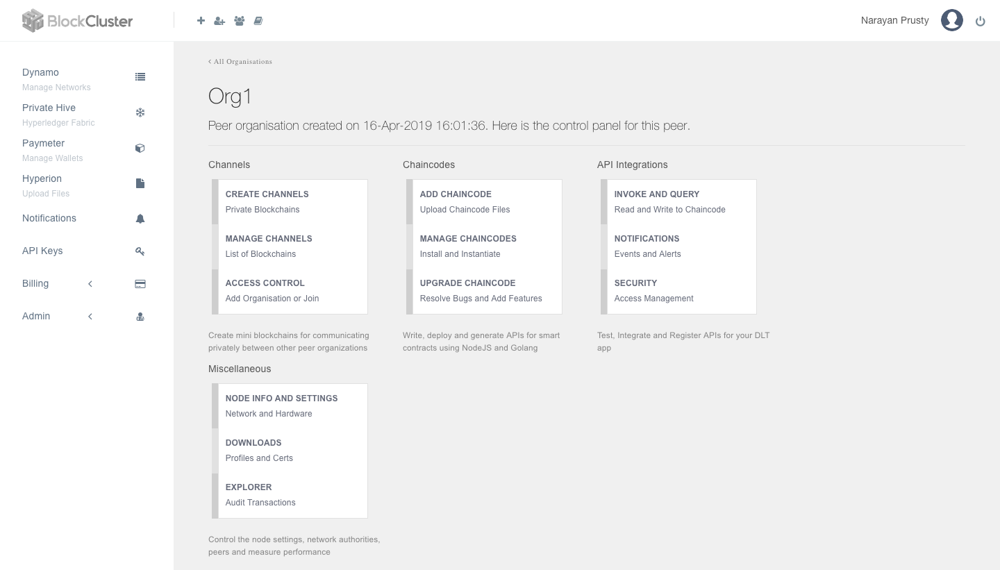

Now click on "Create Channels" and you will see a form to enter channel name and select orderer in which this channel will reside in. Once desired values are filled, click "Create".

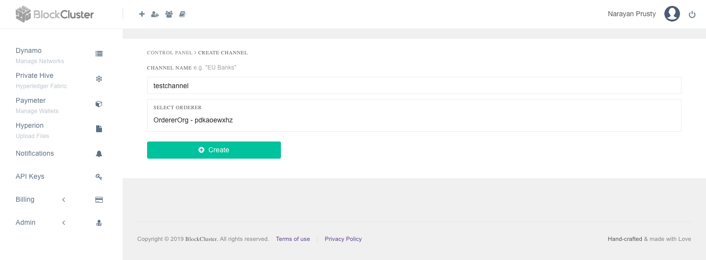

Now go back to control panel and select "Manage Channels" to see the list of channels created.

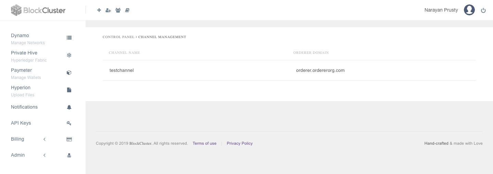

Now Org1 can invite Org2 and Org3 to join the channel. To invite, go to control panel of Org1 and click on "Access Control". Then select the channel and enter email id of the BlockCluster account who owns the Org2 and Org3 peer organisations. In this case, the same account. Click "Send Invite" twice as we are inviting two organisations.

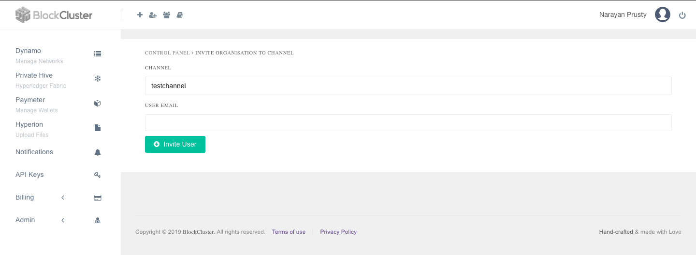

 Now go to invitations and you will see two new invitations received. 

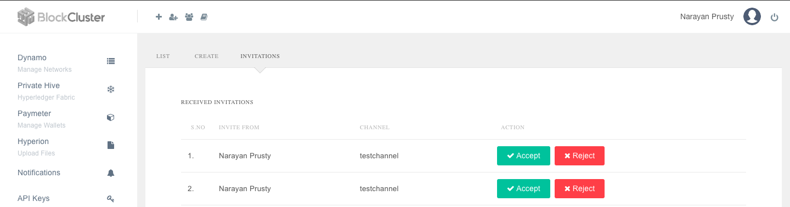

Click "Accept" for first invitation and then you will see a popup. In that popup select "Org2" and click "Join". Similarly do for Org3.

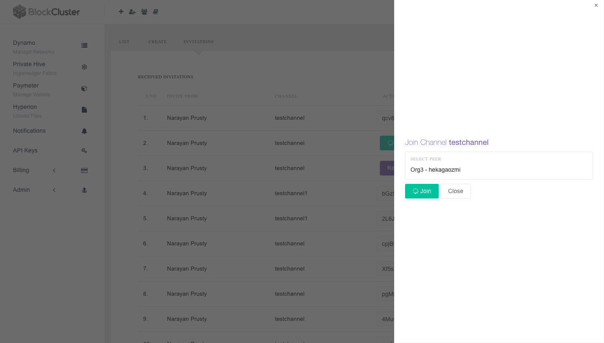

Now to confirm all 3 organisations are part of channel, go to control panel of any peer organisation and click "Explorer" to explore the details of the channels.

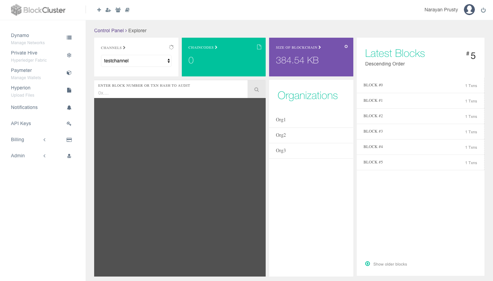

Here you can see that Org1, Org2 and Org3 are part of the channel named "testchannel".

## Uploading, Installing and Instantiating Chaincode

Now we have finished creating the network and channel. Let's deploy and invoke the chaincode. The marbles02_private chaincode needs to be installed on all the peers. 

To upload the chaincode on each peer, go to the control panel of the each peer and click on "Add Chaincode" and upload the chaincode. There is a specific directory structure you have to follow inside the zip file while uploading the chaincode. To upload the marbles02_private chaincode to the peers you need to change it to this directory structure:

```
marbles02_private
├── META-INF
│   └── statedb
│       └── couchdb
│           ├── indexOwner.json
│           └── indexes
│               └── indexOwner.json
└── marbles_chaincode_private.go
```

You can download the .zip file with this directory structure from [here](chaincodes/marbles02_private.zip). Now go ahead and upload the chaincode in all the peers:

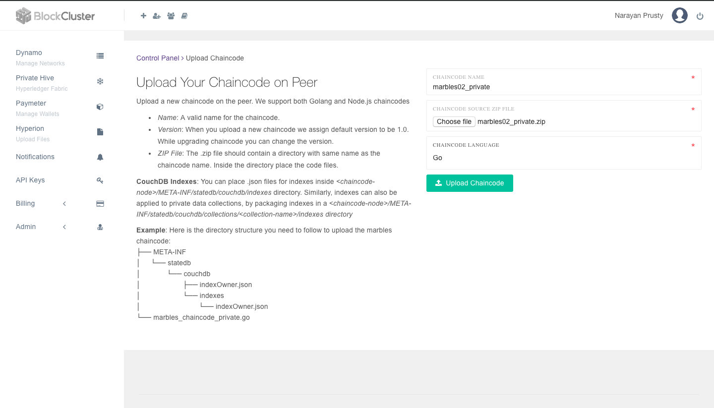

Now you need to install the chaincode in all the peers. To do that, go to control panel of each peer and click on "Manage Chaincodes" and then click "Install" button.

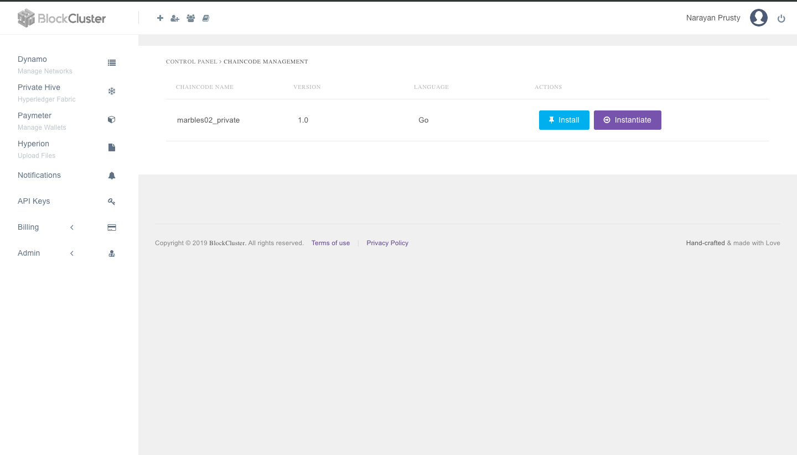

Now once upload and install is done we need to instantiate the chaincode. Any one of the peer organisations needs to instantiate it. Go to Org1 control panel and click "Manage Chaincodes". And then click "Instantiate". You will see a popup. Here you need to specify function name, arguments, endorsment policy and private collections configurations.

 We will create an endorsment policy such that either Org1 or Org2 needs to endorse. And we will use the default collections config that comes with marbles02_private source code. The default collections config shares the private collection "collectionMarbles" with Org1 and Org2. And "collectionMarblePrivateDetails" collection with only Org1.

Here is the endorsment policy:

```
{
  "identities": [
    { "role": { "name": "member", "mspId": "Org1" }},
    { "role": { "name": "member", "mspId": "Org2" }}
  ],
  "policy": {
    "1-of":[{ "signed-by": 0 }, { "signed-by": 1 }]
  }
}
```

Here is the collections config:

```
[{
    "name": "collectionMarbles",
    "policy": {
      "identities": [{
          "role": {
            "name": "member",
            "mspId": "Org1"
          }
        },
        {
          "role": {
            "name": "member",
            "mspId": "Org2"
          }
        }
      ],
      "policy": {
          "1-of": [
          {
            "signed-by": 0
          },
          {
            "signed-by": 1
          }
        ]
      }
    },
    "requiredPeerCount": 0,
    "maxPeerCount": 0,
    "blockToLive": 100
  },
  {
    "name": "collectionMarblePrivateDetails",
    "policy": {
      "identities": [{
        "role": {
          "name": "member",
          "mspId": "Org1"
        }
      }],
      "policy": {
        "1-of": [{
          "signed-by": 0
        }]
      }
    },
    "requiredPeerCount": 0,
    "maxPeerCount": 0,
    "blockToLive": 100
  }
]

```

> Here `requiredPeerCount` has been made 0 because currently Blockcluster let's you create only one peer for organisation. So if you increase the "requirePeerCount" then invoke transactions will fail as the leader peer won't be able to distribute and fulfil the request.

Now instantiate the chaincode with function name as "init":

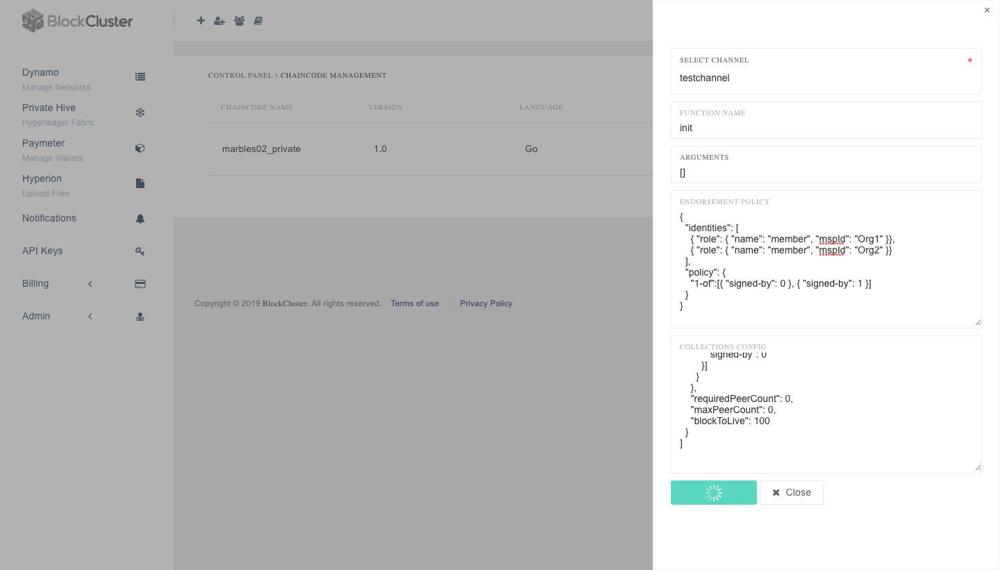

## Invoke and Query Chaincode

Let's invoke a transactions to write a marble. Go to "Org1" control panel and click "Invoke and Query". Here enter the function name as `initMarble` and arguments as `["marble1","blue","35","tom","99"]` . And then click "Invoke".

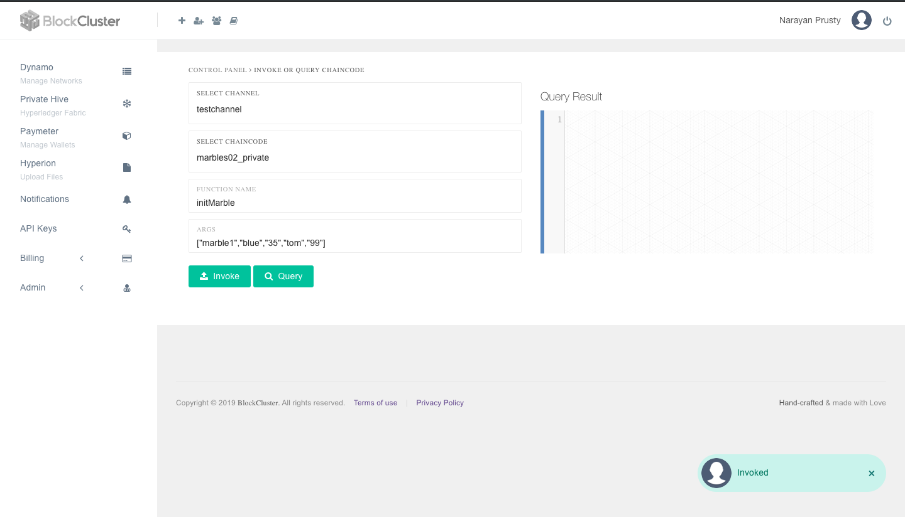

Now let's query the details of "marble1" stored in "collectionMarbles" and "collectionMarblePrivateDetails" collections. To query details from "collectionMarbles", use the function name `readMarble` and arguments as `["marble1"]`

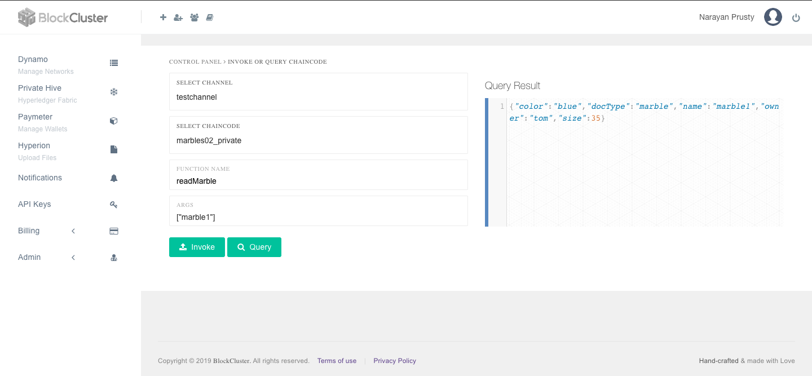

Similarly to query details from "collectionMarblePrivateDetails" collections use the function name `readMarblePrivateDetails` and arguments `["marble1"]`. 

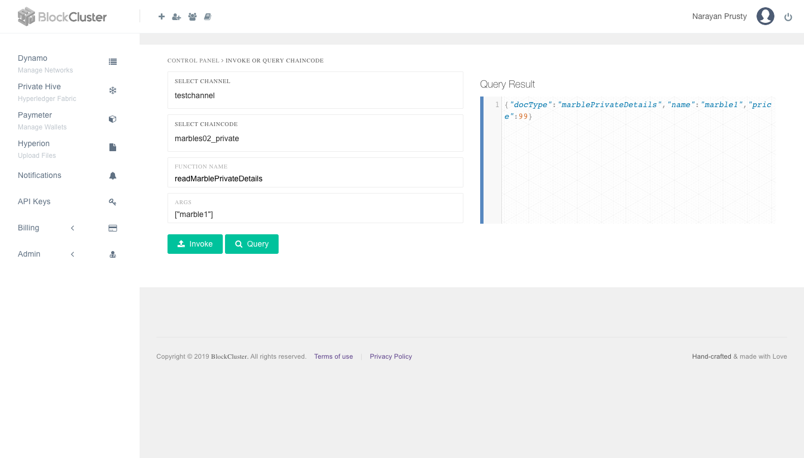

Now as per as collections config, Org2 doesn't have access to "collectionMarblePrivateDetails" collection so if you query using function name `readMarblePrivateDetails` from Org2 peer you will get error but `readMarble` will work:

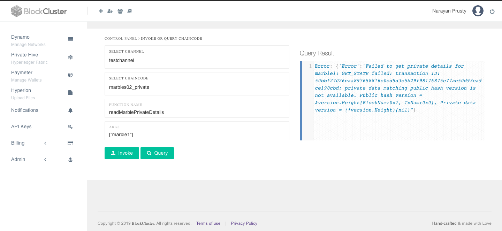

> To call invoke and query from your app, you can use the [REST APIs](privatehive.api.blockcluster.io) or [Node.js SDK](https://www.npmjs.com/package/blockcluster).