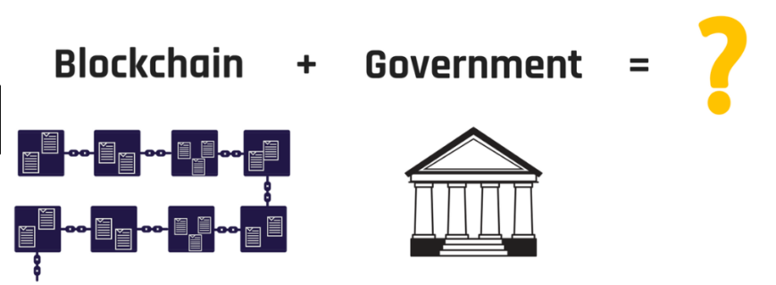

# BlockCluster for Government Processes

Most of the government process involves issuing of tenders and then hiring third-party agencies to carry out projects. The process of issuing tenders itself is prone to malpractices. Blockchain can be the key to streamline processes making them more transparent and efficient. It has the potential to improve the delivery of public services via its interconnected distributed network.

Additionally, it will impart security and trust to the public sector with its immutability and
‘write-once’ feature. It can bridge the gaps between the government and citizen,
improving overall governance and state operations.

## Agriculture Marketplace on Blockchain

Blockchain-based agriculture market place can help farmers sell their produce directly
to retailers &amp; customers. This will speed up the whole process by removing any
intermediaries and help farmers get better prices for their produce, enabling them to
have a better life for themselves and their families.

<u>Problem</u>

Farmers are not able to sell their yield at reasonable prices. Intermediaries eat away
profit margin of farmers. Due to the monopoly of middlemen, farmers sell the crops at
losses.

<u>Solution</u>

A mobile platform, leveraging Blockchain-technology in the back-end can help the
farmers. They would be able to list their yield directly on the marketplace. The transfer
of money happens via Smart Contracts, based on the prices set by the farmers and pre-
defined orders of the customers. This will help both the customers and the farmers by
eliminating middlemen in the supply chain.

<u>How BlockCluster can help in developing such a solution</u>

The produce of the farmers can be issued in the form of assets on the BlockCluster. For
farmers, the interface to the solution would be easy to use mobile application available

in their regional language. The app would be connected to BlockCluster platform via
APIs. Similarly, there will be an app for the end users to view and buy the produce.

## Agriculture: Crop Insurance

Even when the smart weather predictions are available today, there are many delays in
the disbursal of settlement amount in the crop insurance. Blockchain can automate the
process of claim settlement and provide farmers the much-needed funds on or even
before the occurrence of the natural disaster/unfavorable climate conditions.

<u>Problem</u>

The process of filing claims for crop insurance is lengthy. It involves a lot of paperwork
and manual intervention of a field inspector. Since the decision of releasing the funds
and the amount of the funds to be released solely depends on the report submitted by
the field inspector, the process is prone to unethical practices. It takes days, even
month for the farmers to get the money credited in the bank account.

<u>Solution</u>

A mobile platform leveraging Smart Contracts and intelligent weather prediction can
help farmers hedge against climate volatility. Through the use of weather APIs from
different weather prediction websites, the solution provides farmers with the option to
initiate crop insurance payouts on the occurrence of natural disasters/unfavorable
weather conditions.

There would be no need for the field agent’s report since these weather predictions
testify that the specified crop can’t be produced in the pertaining weather conditions and
that the farmers are eligible for the claim amount.

Settlement happens automatically, and the transactions are recorded on the Blockchain.

<u>How BlockCluster can help in developing such a solution</u>

The whole insurance agreement can be recorded in the form of Smart Contract on
BlockCluster which can be configured to execute claim settlement amount upon getting
info from weather APIs.

## E-Governance: Registration of Birth, Marriage, and Death Certificates

Even after the digitalization, most of the data related to the birth, marriage, and death of
a citizen is stored in centralized servers and is prone to falsification. Additionally, the
means to verify this information is limited. Blockchain can help to build a comprehensive
decentralized toolset for identity verification.

<u>Problem</u>

Paper-based certificates can be forged or reproduced. The process of issuing such
documents is prone to error and discrepancies. Due to manual and centralized
handling, the process is susceptible to frauds and distortion.

<u>Solution</u>

The Blockchain solution will allow doctors and parents present at the birth to log and
register the birth (and other information, such as the blood type) on a permissioned
Blockchain, accessible only with a digital crypto key.

Since it is a permissioned Blockchain, only some key officials would have authority to
enter the data. The data can only be appended (not edited). The certificate then can be
issued digitally. Similarly, it can be applied to death and marriage certificates.

<u>How BlockCluster can help in developing such a solution</u>

The digital certificates can be issued in the form of assets on BlockCluster, and various
types of information can be added to this asset. Furthermore, asset-based
permissioning will enable only a few officials to access specific information. Only the
issuer of the asset can make changes in the information, and all the changes are easily
traceable.

## E-Governance: Asset Registration (Land, Property, Vehicle, etc.)

Blockchain can be utilized to securely issue and store the details of the tangible assets
like land, property, vehicle, etc. and create a chain of custody as the ownership of these
assets get transferred from one person to another.

<u>Problem</u>

Physical assets get occupied (land &amp; property) and stolen (vehicle) by different means.
It is difficult to determine the owner of the asset since everything can be morphed by the
perpetrators. A massive amount of time and money is spent to prove the ownership of
the asset; and if the culprits are able to prove that the asset belongs to them, then the
innocent citizens suffer, and the entire judicial system becomes questionable.

<u>Solution</u>

A Blockchain solution can store the details associated with the assets in digital format
on an immutable distributed ledger network. This private ledger will only be accessed
by the police, government officials, and insurance companies’ representatives.

Assets that are prone to thefts can be equipped with GPS locators or IoT devices that
can send information about the whereabouts of the asset from time to time.

<u>How BlockCluster can help in developing such a solution</u>

Assets like these can be issued by the government on the BlockCluster, and different
types of information can be associated with them. The government official can then
transfer ownership of the asset to the buyer. Later, when the property gets sold, the
ownership can be again transferred, forming an immutable chain of ownership, clearly
indicating who owns the property at present.

## E-Governance: Ensuring Correctness of Taxes Filed

Blockchain can be utilized to ensure honest reporting and keeping track of different
phases of taxing.

<u>Problem</u>

There is a lack of honest reporting of actual information. Manual and centrally controlled
invoices are prone to mistakes/falsification and can be misplaced. Un-channelized
Involvement of strata of intermediaries such as banks, traders, regulators, exchanges,
etc. makes it difficult in managing the transfer of ownership of goods.

<u>Solution</u>

The real-time recording of the data on the Blockchain with Smart Contracts and AI can
ensure correctness and automation of information about “How, When, and Where” the
tax applies.

Issuance of the invoices on the distributed ledger will make it harder to do any kind of
falsification. Also, the presence of multiple evaluators will make instances of
miscalculation and mistakes negligible due to the distributed nature of Blockchain.

A complete audit trail is maintained throughout the chain of custody of goods. The
permissioned parties can access the copy of the ledger and validate the transactions
without having to trust the other participants.

Smart contracts can impose asset-based ownership in the entire lifecycle, i.e. from
manufacturing to the consumption of goods.

<u>How BlockCluster can help in developing such a solution</u>

The manufacturers can create and issue asset on the BlockCluster that would represent
goods. The authorized participants can transfer the ownership of the asset as the
custody of products gets transferred physically. The recipient of the asset can issue an
invoice as separate assets to the sender, containing all the transaction amount details
that can be fetched by APIs to do tax calculations.

## M-Governance: Driving License/RC

Blockchain can be utilized to securely issue and store driving licenses (DL)/vehicle
registration certificates (RC).

<u>Problem</u>

Citizens need to carry their RC and DL with them always. The paper-based RC and DL
or the centrally controlled digital copy of RC &amp; DL can be forged and reproduce. The
process of issuing RC/DL is prone to frauds such as impersonation and the process of
re-issue of RC/DL, in case it gets lost, is cumbersome.

<u>Solution</u>

A car manufacturer registers a new car, then the car retailer associates it with its remote
control lock, geo location, and the owner details. This information is stored in a shared
ledger via a public key which is selectively accessible by the police, local government,
and insurance company.

All the information can be accessed via a mobile app installed on the citizen mobile
phone. They can report a loss of vehicle and file claims to the insurance company
instantly with the mobile app.

The fraud instances such as impersonation can be contained by matching the details
provided by the user with the details stored in the distributed ledger. Similarly, reporting,
storage, and issuance can be applied for the driving license as well. Since the possibility
of impersonation is eliminated, the process re-issuance can be done quickly.

<u>How BlockCluster can help in developing such a solution</u>

RC/DL can be issued as assets on the BlockCluster with all the information of the
vehicle and owner. The citizens can access this information via a mobile app, so they
don’t need to carry the physical copy. The re-issuance and lost request can be filed via
the mobile app itself to hasten the process.

## Judiciary: Simplification of Notary

Blockchain stamping can certify the existence of an electronic document’s content at a
particular point in time.

<u>Problem</u>

Acknowledgment of the signed documents and the process to prove its veracity
presently done by the notary is prone to falsification and fraud. Fabricated stamps is
another problem. There is no guarantee that the signer has signed the document in the
presence of Notary.

<u>Solution</u>

First, all the original documents can be uploaded on Blockchain, and their hashes can
be created and stored on the Blockchain. At the time of verification, the SHA256 hash of
the presented document, when embedded with the document with a time stamp, can
serve as a ‘digital stamp.’ With this, verification of the document becomes easy by
matching the hash of the document uploaded at the time of verification and the hash of
the original document.

This publicly time stamped statement can be used in the future by the citizens to justify
that the content was in their possession at that particular time.

## Administration: Incorporation Service

Blockchain can ease and speed up the process of setting up of businesses and make it
more fair, secure, and transparent.

<u>Problem</u>

Complex and time-consuming procedure for registering a business. Complexity in
obtaining the necessary licenses and permits is also a big problem. Common instances
of corruption, favoritism and inefficient processes.

<u>Solution</u>

Registering the businesses in any distributed ledger technology will automate and cut
the time involved in the entire process.

The details stored cryptographically in Blockchain can enable the authorities or
agencies to provide the permissions and licenses readily. It can do away with the need
for third-party verification and expedite the whole process.

The distributed nature of the ledger will ensure a fair and transparent environment in
every procedure. The feature of Smart Contracts can automate a lot of processes and
make it mandatory for businesses to fulfill the defined criteria in order to get permits and
licenses. Thus, doing away with the instances of favoritism and corruption.

<u>How BlockCluster can help in developing such a solution</u>

The registration of the businesses can be done on BlockCluster in the form of assets
that would contain all the details of the business. All the required document need to be
uploaded via a mobile app and hashes of these documents will get stored in the asset
information to ensure all the pre-requisites are met. The hashes of these document
should match the hashes of previously documents uploaded by the business.