# Industry Overview

Healthcare industry deals with a lot of data daily. This data is generated from various sources including diagnostic machines, hospital administration, drug stores, medical device manufacturers, clinical trials, health surveys and studies, prescriptions and so on. Since it is very confidential, this data is kept locked in silos and can’t be utilized to do any sort of analysis. The various stakeholders of this industry have always struggled to share data securely with each other.

# Challenges

Here are various challenges faced by the healthcare industry:

## Interoperability of Data

The digital systems of the hospitals are based on different platform and hence cannot communicate with each other, more because the data is stored in different formats.

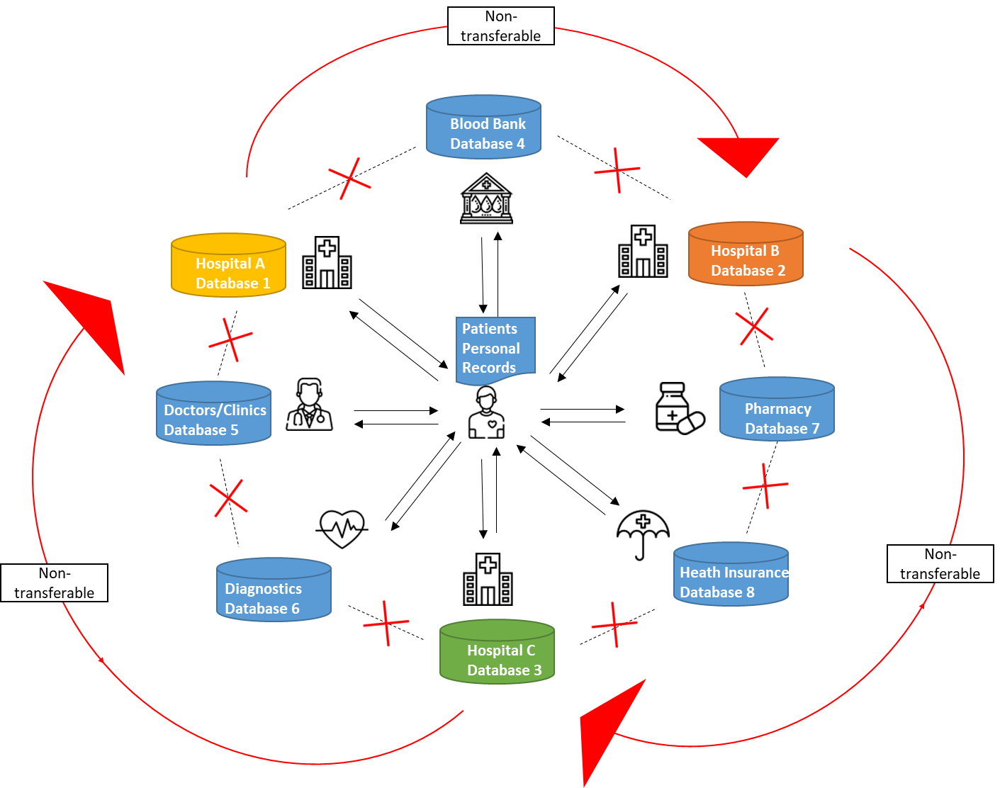

Above diagram is an illustration of a healthcare ecosystem. There are 8 different databases that exist independently and are not connected with each other. Moreover, the data from Hospital A, B, & C’s database is not transferable since it is in different formats. 

## Unauthorized Access

In the event of a transfer of a patient from one hospital to another, sharing of digital data becomes a challenge as the hospitals don't have secure access to each other's databases. 

In case user chooses the transfer data in paper then challenge of trust arises. Paper-based records can be easily copied and tempered. 

## HIPAA Compilance

The HIPAA Privacy Rule safeguards PHI (Protected Health Information) stored or transmitted by a healthcare entity in any form or medium, whether electronic, on paper, or oral. It was designed to permit only certain uses and disclosures of PHI provided by the Rule and to create information that is not individually identifiable by following the de-identification standard and implementation specifications. With so many security loop holes and data leaks possibilities, HIPAA compliance is a challenge for most of the healthcare institutes.

## Predictive Healthcare and Analysis

With the history of effects of medicine on different individuals, outcomes of different treatment plans, post-surgery experiences of implants, and a lot of other data points, the effects of a particular medicine or a treatment plan can be predicted utilizing artificial intelligence and machine learning algorithms. Moreover, based on historical data, it can be predicted that what medical condition a patient might encounter in the future depending on his current health conditions and lifestyle. Accordingly, measures can be taken to prevent such future condition (predictive healthcare).

Predictive healthcare A.I. and machines learning algorithms require access to all the data from all the stakeholders simultaneously to make the right prediction. Such access is not possible in today’s scenario due to regulatory compliances. 

# How blockchain helps?

In a Blockchain Healthcare ecosystem, all the stakeholders as shown in the illustration below are connected with each other in a network having a distributed ledger or shared database. Each stakeholder in the network has a copy of the database, but only those with the right credentials would be able to access the information stored on it.

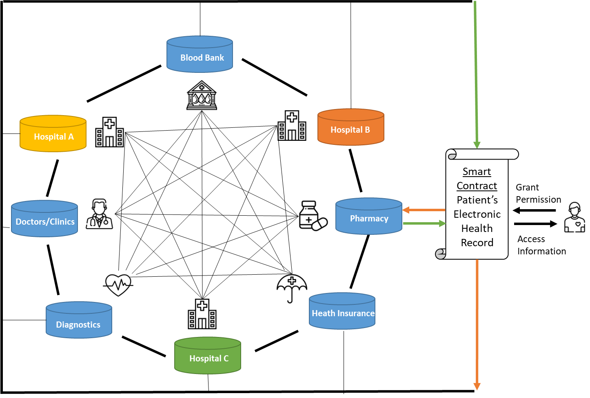

## Secure Sharing of Electronic Health Records via Proxy Re-encryption

A distributed proxy re-encryption server would store EHRs of all patients encrypted using patients private key. A public key can be the unique identifier of the patient on the Blockchain network. Only the hospitals and other healthcare institutions that patient has given access to can read the records. 

The patients would not need to share private key to grant access instead through the proxy re-encryption server they can grant encrypted data access to other private keys.

## Data Interoperability & HIPAA Compliance via Smart Contracts Rules

Smart Contracts can ensure that the fetched information follow HIPAA Privacy rule. The pre-defined conditions written in the Smart Contract would only allow specific information to be shared, as allowed by the HIPAA compliance. These pre-defined conditions can also ensure that the data generated from various stakeholders is stored in the required format as per the compliance. Since all the data exist in a single predefined format, it can be readily used by any stakeholder in the network, enabling data interoperability between different hospitals.

Due to the fact that blockchain proxy re-encryption enable anonymous identity and  secure data sharing therefore blockchain makes the whole network HIPAA compliant.  

## **Hashing to Prevent Unauthorized Copying of Data**

The data generated from various healthcare holders can be stored on Blockchain in the form of cryptographic hashes, which makes it impossible to change any data. SHA-256 hash algorithm can be used for this purpose, which is a “one-way” function that can’t be decrypted back to get the original text. It converts the text of any size into a unique fixed 32-character string. No two data pieces can produce the same string. Even a minute change in data would result in a different string.

## **De-identification and Predictive Analysis**

The information from various Smart Contracts can be fetched for predictive analysis. Since these Smart Contracts are coded to share specific information for a particular purpose, they would only allow access to non-identifiable information of the patients. In such a scenario, a machine learning/Artificial Intelligence algorithm can learn from a huge amount of data present in the whole Healthcare Ecosystem and make predictive analysis for specific medical conditions. 

# How to Store and Share Health Records using Blockcluster

Let's build a quick PoC in which there will be multiple hospitals in the network, each hospital can write their data to blockchain and how they can share specific data with each other.

## Step 1: Create Network

One of the hospitals has to first create a blockchain network. First hospital will sign in into https://app.blockcluster.io and then will see this screen:

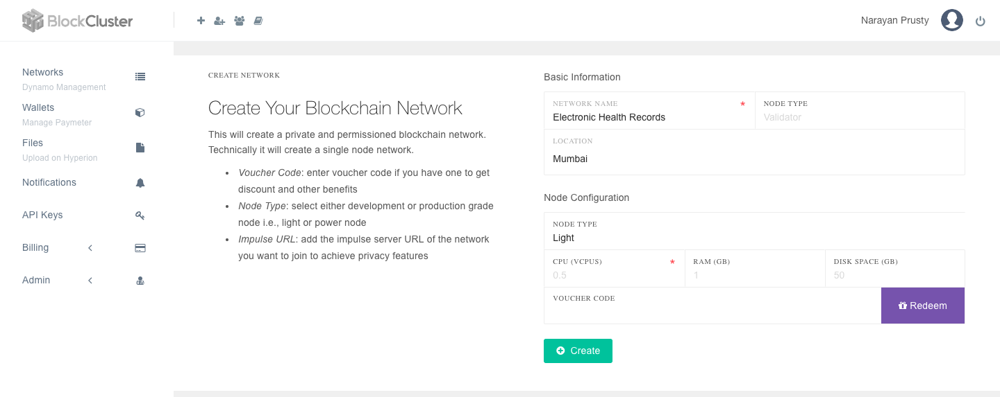

Here the hospital will enter the network name of their wish and select location for data storage. Then click "Create" button. This will create the first node of the network. 

It will take few minutes to deploy the blockchain node. Meanwhile they should be able to see the node control panel which looks something like this:

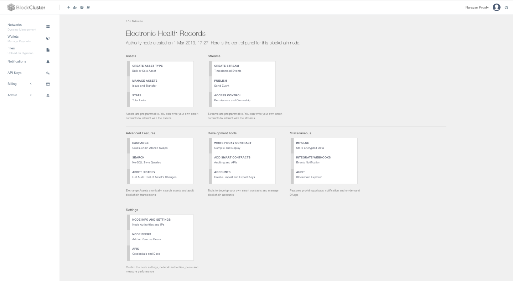

## Step 2: Invite other Hospitals to Join Network

Once your node is up and running it's time for the first hospital to invite the other hospitals to the network. To invite they will visit https://app.blockcluster.io/app/join/networks and click "Invite user to Network". They will see a screen similar to this:

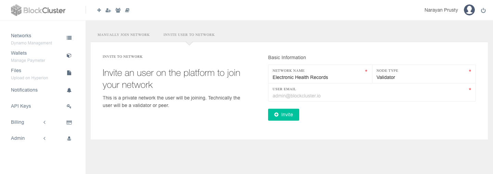

Here they will enter the email ID of the hospital whom they want to invite and click invite.  Once done the other hospital can visit https://app.blockcluster.io/app/invites and see the invitation. The other hospital will see a screen similar to this:

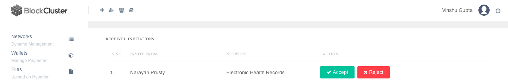

Now the other hospital can click "Accept" to accept the invitation and join the network. After clicking "Accept" they will be promoted to select node configuration and location which they can select as per as their requirements.

Once the second hospital's node is running they can check if they are connected to the first node by clicking "Node Peers" button in the control panel of their node and check the static nodes they are connected to:

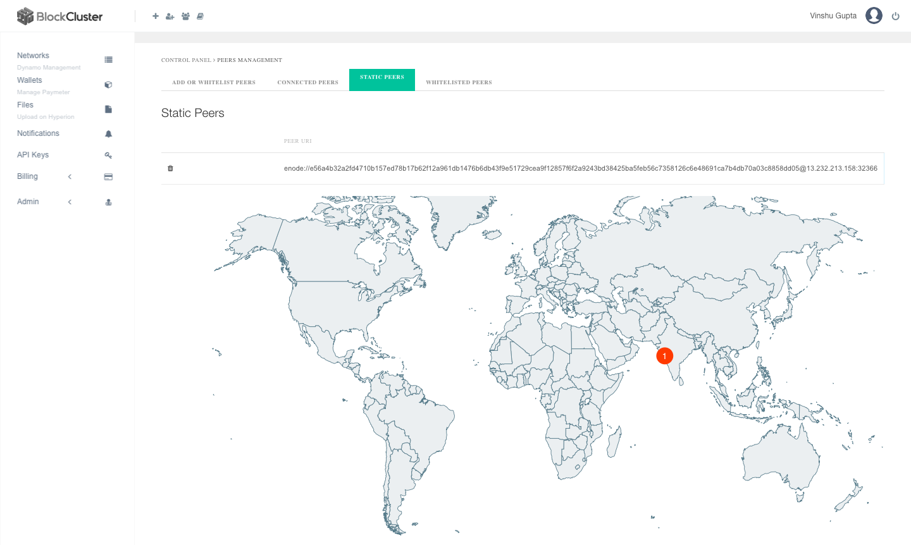

## Step 3: Storing Health Records

Now it's time for the first hospital to store some health records. They will click on "Create Asset Type" in the control panel of their's node. They will see a screen similar to this:

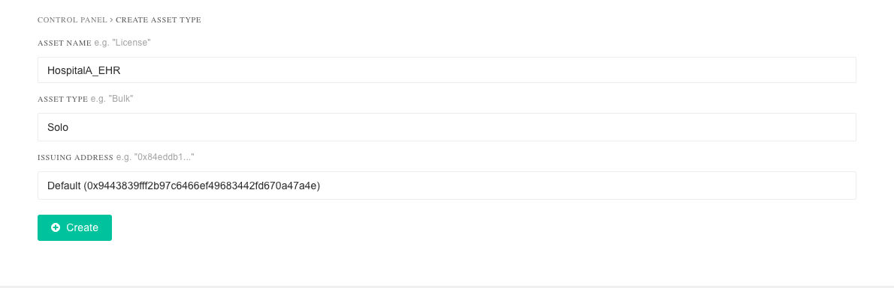

Here they will enter asset name as "HospitalA_EHR" to make their EHRs identifiable separately in the blockchain. 

Now they will issue a sample EHR on blockchain. To issue asset they will click on "Manage Assets" in the control. Then they will have to enter the owner of the asset and a unique ID of the asset. In this use-case, they will be owner of the asset. Their blockchain account ID can be found under "Account" in control panel which they will copy/paste there. And then click "Issue Asset". Here is the screen how it will look like:

Currently the asset doesn't make sense. It just has an owner and unique id. They need to add more data to the asset. For this they need to click on "Add/Update Solo Asset Info". Then they can enter various information for the EHR in form of key-value pair. For each key-value they can choose if the information will be private or public. If pubic is selected then it will be visible to every hospital in the network and if private is selected then it will be only visible to them until they grant access to other hospitals.

Here is how the screen will look like when they are entering details:

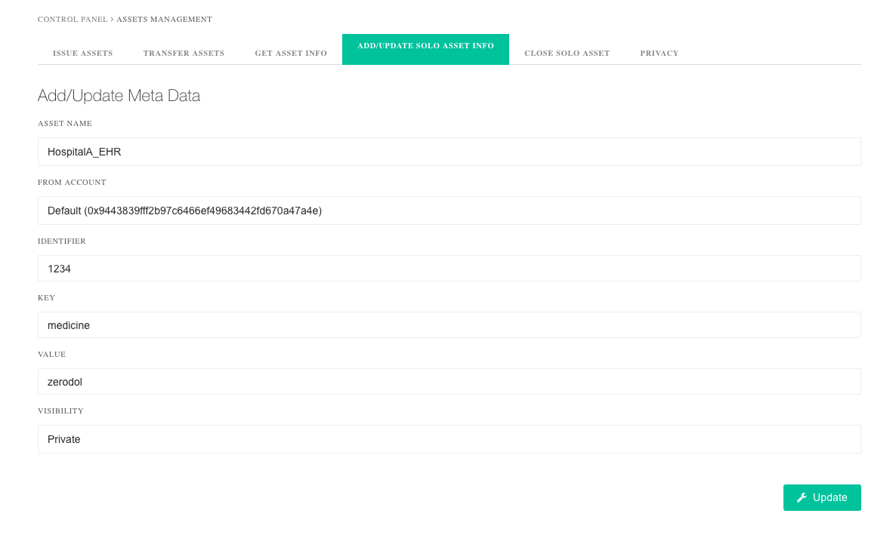

Now to see the full asset info they can click on "Get Asset Info" and then enter the asset id and retrieve the info. The result will look something like this:

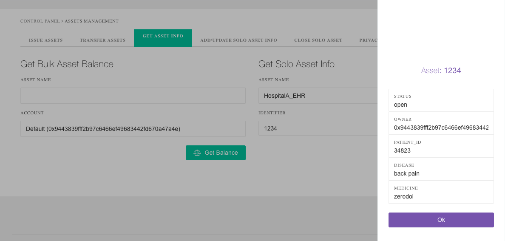

Here the hospital entered the "medicine" key as private and rest everything public. If the other hospital will try to get the asset information they won't see the "medicine" field but rest will be visible. This is how it would look for the other hospital:

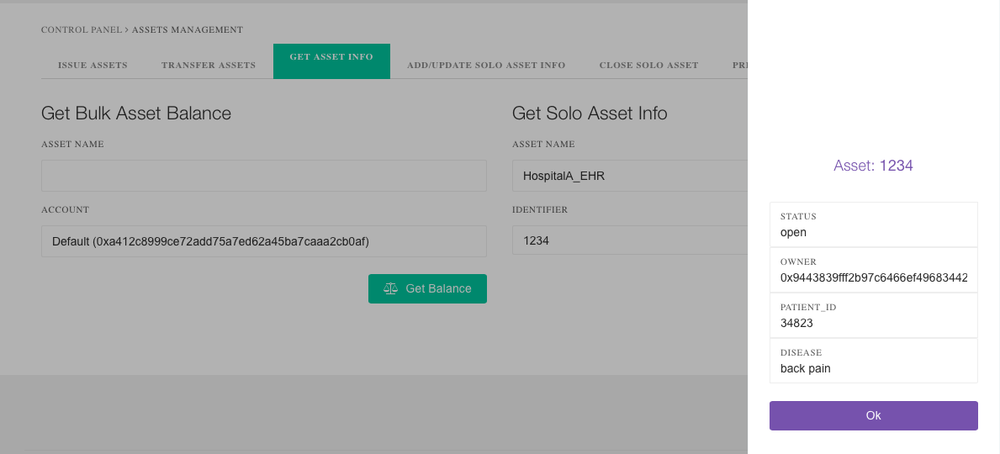

## Step 4: Sharing Data

Now if the patient who this EHR belongs to wants first hospital to share this info with the other hospital then this is how the first hospital will share the data:

First the other hospital will share their proxy re-encryption public key with first hospital. To find the public key, the second hospital will click on "Impulse" in their node's control panel and copy the key. This is how it will look like: 

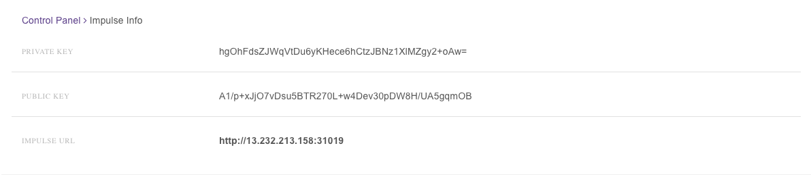

Then the first hospital will go the "Manage Assets" and then click "Privacy". Here they will paste the public key and enter the asset id. Then click "Grant Access" to give them access to masked information of the asset. Here is how the screen will look like:

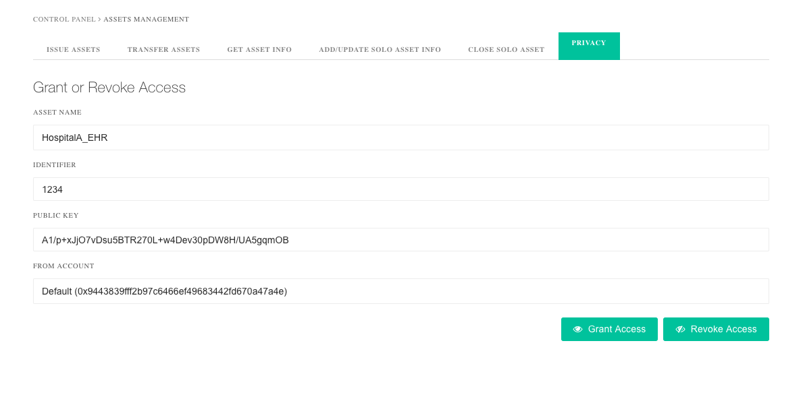

Now if the other hospital tries to read the EHR information then they will see the "medicine" name. Here is how it will look like:

> Obviously for sharing data hospitals will not follow these manual steps. In the real DApp, the APIs will be used. The sharing of public key can be automated on the application layer using various mechanisms such as QR Code, OAuth and so on depending on the user-flow.

## Step 5: Auditing

To audit everything, the hospitals can simply click on "Explorer" in the node's control panel. There they will see transactions, blocks and audit specific transactions. Here is how it will look like:

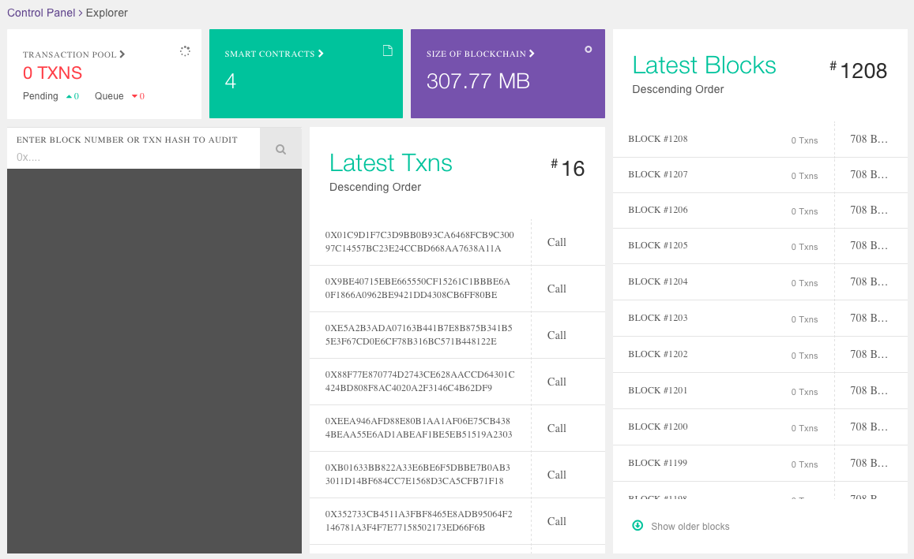

Also they can get a detailed audit report of a specific asset in PDF. For this they have to click on "Asset History" in control panel and enter the asset ID. Here is how the pdf will look like:

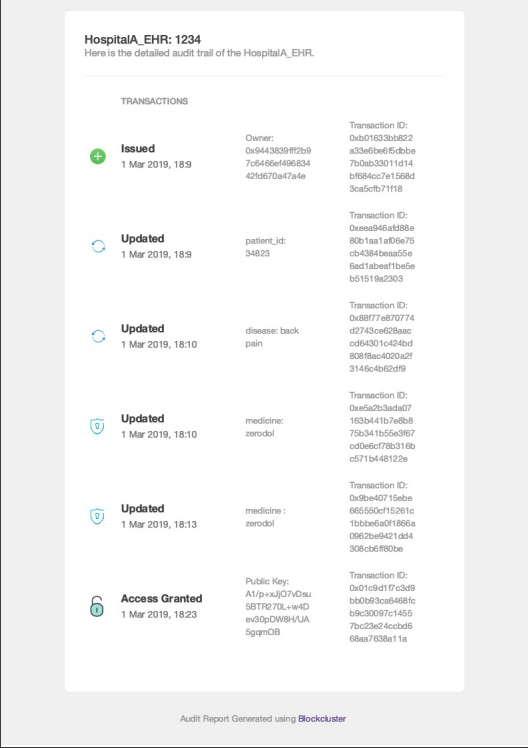

## Step 6: File Upload

Hospitals can also upload the EHR digital files and share with others. For this they will have to click on "Upload Files" in the left menu of the dashboard and upload files. Every file will have a unique hash which is the fingerprint of the file. Anyone with the hash of the file can download the file. The hash can be store as asset meta data as a private key-value. Here is how the upload screen looks like:

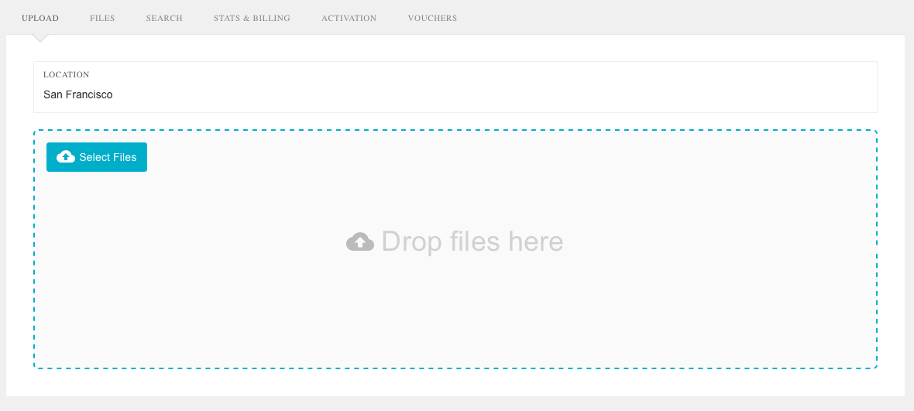

