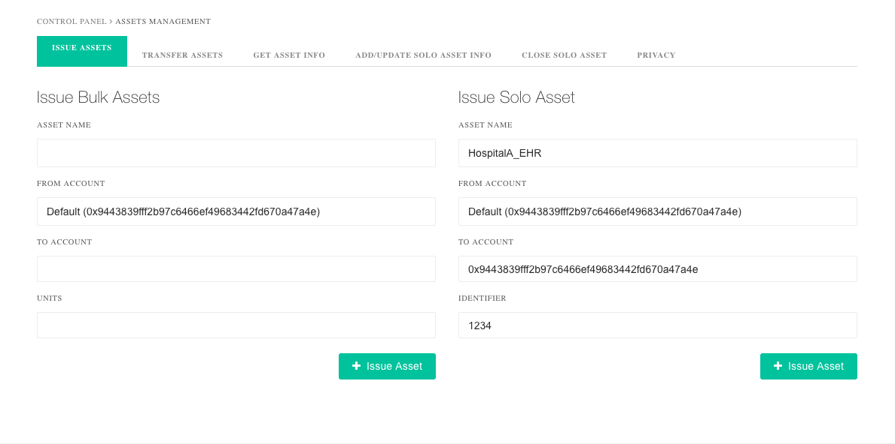

# Industry Overview

Healthcare industry deals with a lot of data daily. This data is generated from various sources including diagnostic machines, hospital administration, drug stores, medical device manufacturers, clinical trials, health surveys and studies, prescriptions, and so on. Since it is very confidential, this data is kept locked in silos and can’t be utilized to do any sort of analysis. The various stakeholders of this industry have always struggled to share data securely with each other.

# Challenges

Here are various challenges faced by the healthcare industry:

## Interoperability of the Data

The digital systems of the hospitals are based on different platform and hence cannot communicate with each other, more because the data is stored in different formats.

Above diagram is an illustration of a healthcare ecosystem. There are 8 different databases that exist independently and are not connected with each other. Moreover, the data from Hospital A, B, & C’s database is not transferable since it is in different formats.  

## Unauthorized Access

In the event of a transfer of a patient from one hospital to another, sharing of digital data becomes a challenge as the hospitals don't have secure access to each other's databases. 

In case the user chooses to transfer data in the paper format, then the issue of trust arises. Paper-based records can be easily copied and tempered. 

## HIPAA Compilance

The HIPAA Privacy Rule safeguards PHI (Protected Health Information) stored or transmitted by a healthcare entity in any form or medium, whether electronic, on paper, or oral. It was designed to permit only certain uses and disclosures of PHI provided by the Rule and to create information that is not individually identifiable by following the de-identification standard and implementation specifications. With so many security loopholes and data leaks possibilities, HIPAA compliance is a challenge for most of the healthcare institutes.

## Predictive Healthcare and Analysis

With the history of effects of medicine on different individuals, outcomes of different treatment plans, post-surgery experiences of implants, and a lot of other data points, the effects of a particular medicine or a treatment plan can be predicted utilizing artificial intelligence and machine learning algorithms. Moreover, based on historical data, it can be predicted that what medical condition a patient might encounter in the future depending on his current health conditions and lifestyle. Accordingly, measures can be taken to prevent such future condition (predictive healthcare).

Predictive healthcare A.I. and machines learning algorithms require access to all the data from all the stakeholders simultaneously to make the right prediction. Such access is not possible in today’s scenario due to regulatory compliances. 

# How does Blockchain helps?

In a Blockchain Healthcare ecosystem, all the stakeholders as shown in the illustration below are connected with each other in a network having a distributed ledger or shared database. Each stakeholder in the network has a copy of the database, but only those with the right credentials would be able to access the information stored on it.

## Secure Sharing of Electronic Health Records via Proxy Re-encryption

A distributed proxy re-encryption server would store EHRs of all patients encrypted using patients private key. A public key can be the unique identifier of the patient on the Blockchain network. Only the hospitals and other healthcare institutions that patient has given access to can read the records. 

The patients would not need to share the private key to grant access instead through the proxy re-encryption server they can grant encrypted data access to other private keys.

## Data Interoperability & HIPAA Compliance via Smart Contracts Rules

Smart Contracts can ensure that the fetched information follow HIPAA Privacy rule. The pre-defined conditions written in the Smart Contract would only allow specific information to be shared, as allowed by the HIPAA compliance. These pre-defined conditions can also ensure that the data generated from various stakeholders is stored in the required format as per the compliance. Since all the data exist in a single predefined format, it can be readily used by any stakeholder in the network, enabling data interoperability between different hospitals.

Due to the fact that blockchain proxy re-encryption enable anonymous identity and  secure data sharing therefore blockchain makes the whole network HIPAA compliant.  

## **Hashing to Prevent Unauthorized Copying of Data**

The data generated from various healthcare stakeholders can be stored on Blockchain in the form of cryptographic hashes, which makes it impossible to change any data. SHA-256 hash algorithm can be used for this purpose, which is a “one-way” function that can’t be decrypted back to get the original text. It converts the text of any size into a unique fixed 32-character string. No two data pieces can produce the same string. Even a minute change in the data would result in a different string.

## **De-identification and Predictive Analysis**

The information from various Smart Contracts can be fetched for predictive analysis. Since these Smart Contracts are coded to share specific information for a particular purpose, they would only allow access to non-identifiable information of the patients. In such a scenario, a machine learning/artificial intelligence algorithm can learn from a huge amount of data present in the whole healthcare ecosystem and make predictive analysis for specific medical conditions. 

# How to Store and Share Health Records using BlockCluster

To understand the process of storing and sharing EHR using BlockCluster, let's us build a small PoC in which there will be multiple hospitals in the network. Each hospital can write its data on the Blockchain and share specific data with other hospitals.

The detailed steps are given below:

## Step 1: Create a Network

First, one of the hospitals needs to first create a Blockchain network. The representative from the primary hospital will sign into <https://app.blockcluster.io> and will see this screen:

Here, the hospital’s representative will enter the network name of their choice and select the location where they want their data to be stored. And click the 'Create' button. This will create a one node Blockchain network.

It will take a few minutes for the node to initialize. Meanwhile, user can see the node’s control panel which looks like this:

## Step 2: Invite other Hospitals to Join the Network

Once the node is up and running, it's time for the primary hospital to invite the other hospitals to the network. To send invitation, representative from the primary hospital need to visit https://app.blockcluster.io/app/join/networks and click 'Invite user to Network.' The user will see a screen as shown below:

On this screen, user needs to enter the email ID of the hospitals to be invited and click ‘invite.’ Once done, the other hospital can visit <https://app.blockcluster.io/app/invites> and see the invitation in a screen as shown below:

Now the other hospitals’ representative need to click 'Accept' to join the network. The user will be prompted to select node configuration and the location, which they can select as per their choice.

Once the other hospitals’ nodes are up and running, they can check if they are connected to the primary node (hospital) by clicking 'Node Peers' button in the control panel and check the static nodes they are connected to, as shown below:

## Step 3: Storing Health Records

After the network of the hospitals is ready, the primary hospital can initiate the process of storing health records. Its representative will click on 'Create Asset Type' in the control panel and will see a screen as
shown below:

Here the user will enter the asset name as 'HospitalA_EHR' to make the EHRs of the primary hospitals identifiable separately on the Blockchain network. 

Now, the primary hospital can issue the EHR on the Blockchain. To issue asset (EHR), its representative will click on 'Manage Assets' in the control. The user needs to enter the owner of the asset and a unique ID
of the asset. In this use-case, the primary hospital will be the owner of the asset. The primary hospital’s Blockchain account ID can be found in the 'Account' section in control panel, which the user needs to copy/paste in the 'To Account' field. And then click 'Issue Asset' as shown in the screen below:

The recently issued EHR doesn’t have any information. It just has an owner and a unique ID. The user needs to add data to this asset (EHR). For this, user needs to click on 'Add/Update Solo Asset Info.' Then, the user can store different types of information with the EHR in the form of key-value pair. For each key-value,
user can choose if the information will be private or public. If public is selected, then the information will
be visible to every hospital in the network and if private is selected, then it will be visible only to the primary hospital until it grant access to other hospitals. Refer the below image.

To see the full asset info, the users can click on 'Get Asset Info' and then enter the asset ID and retrieve the info. The results will appear as shown below:

In this image, the primary hospital's representative has entered the 'medicine' key as private and rest of the information is public. If the other hospitals will try to get this asset's (EHR) information, they won't see the 'medicine' field but rest of the information will be visible as shown in the below image.

## Step 4: Sharing the Data

Now, if the patient to whom this EHR belongs, wants the primary hospital to share this info with any other hospital, then this is how the first hospital will share the data:

First, the other hospital will share their proxy re-encryption public key with the primary hospital. To find the public key, other hospital will click on 'Impulse' in their node's control panel and copy the key as shown below:  

Then the primary hospital representative need to click on the 'Manage Assets' and then click 'Privacy.' Here, they will paste the public key and enter the asset ID. And then click 'Grant Access' to give other hospital access to masked information of the asset as shown below:

After granting the access, if the other hospital tries to read the EHR information, then they will see the 'medicine' name as shown below:

> Obviously for sharing data hospitals will not follow these manual steps. In real DApp, the APIs will be used. The sharing of the public key will be automated on the application layer and hospitals will be able to share public key using various mechanisms such as QR Code, OAuth, etc. depending on the user-flow.

## Step 5: Auditing

To audit everything, the hospitals can simply click on 'Explorer' in the node's control panel. There they will see transactions, blocks, and audit specific transactions. Here is how it will look like:

Also, they can get a detailed audit report of a specific asset (EHR) in PDF. For this, they have to click on 'Asset History' in the control panel and enter the asset ID. Here is how the pdf will look like:

## Step 6: File Upload

Hospitals can also upload the EHR digital files and share with others. For this, they will have to click on 'Upload Files' in the left menu of the dashboard and upload files. Every file will have a unique hash which is the fingerprint of the file. Anyone with the hash of the file can download the file. The hash can be store as asset’s metadata as a private key-value. Here is how the upload screen looks like:

